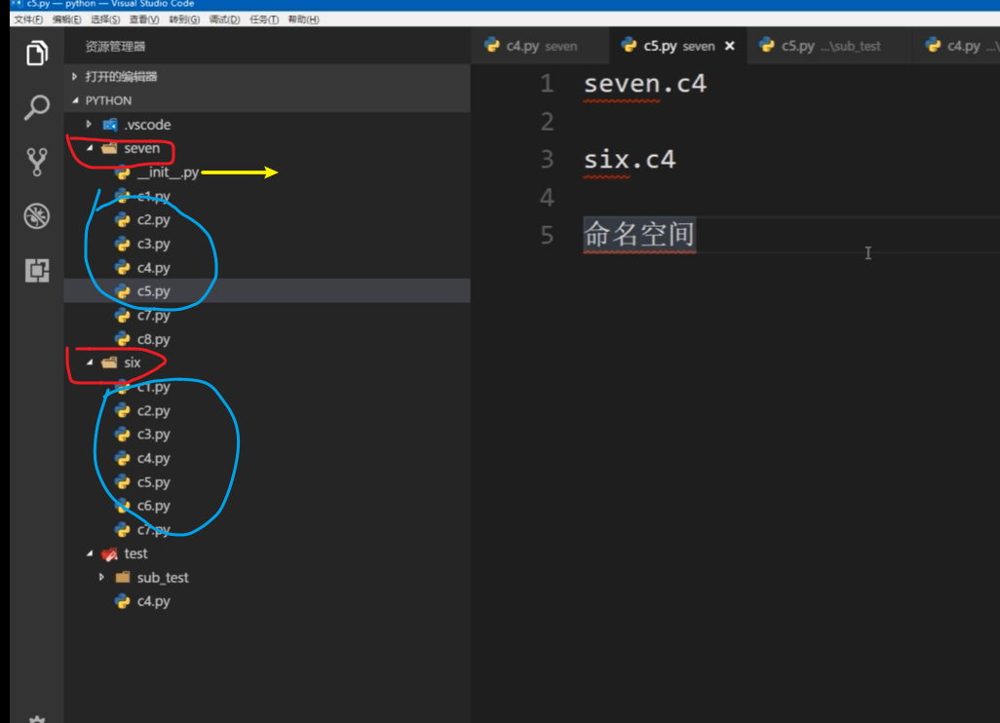

@ 创建日期:2020 年 1 月 25 日,01 点 10 分

@ 更新日期:2020 年 1 月 25 日,01 点 11 分

# `包`

## 什么是包?

- 包就是文件夹
- 包的名字就是文件夹的名字

## 包的作用?

    包是用来存放模块的

## 如何区分不同包的两个同名模块?

- 可以通过命名空间来区别(**包的名字`.`模块名**,形成的路径就叫命名空间)
- 模块内的内容是不相同的
  > 

## 可以创建子包吗?

- 可以创建子包
- 也可以创建和包平级的子包

## 如何区分包和普通的文件夹?

- 如果想让文件夹成为包,必须在文件夹下面建立一个特定的文件`__init__ .py`
- `__init__.py`这个特殊的文件,本身也是一个模块(这个文件内可以有代码,也可以是空的文件)
- `__init__.py` 这个文件的名字,就是包名.
