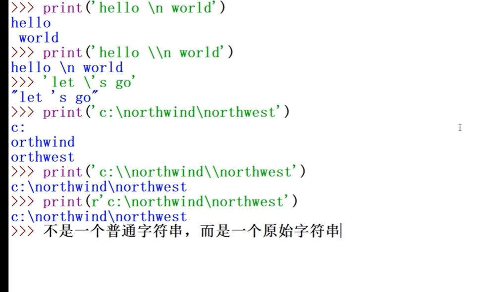

@ 创建日期:2020 年 1 月 17 日,00 点 14 分
@ 更新日期:2020 年 1 月 17 日,00 点 15 分

## 转义字符(特殊的字符)

无法'看见'的字符,
与语言本身语法有冲突的字符.

- `\` 转义
- `\n` ,换行
- `\'` ,单引号
- `\r` ,回车
- `\t` ,横向制表符
- `\\`

```py

#将'hello \n world'打印为一行
   print('hello \\n world')

   打印结果为: hello \n world


#将打印'let's go'
   print( 'let\'s go')

    打印结果为:let's go


# 请输出文件夹的路径
    print('c:\nghgogakj\nthgk')
    # 文件路径\后面的文件名n,电脑会默认为是换行的意思
     输出结果为:c:
               ghgogakj
               thgk

  方法一:
    print('c:\\nghgogakj\\nthgk')
      # 增加转义符\

      输出结果为: c:\nghgogakj\nthgk

  方法一:
    print(r'c:\nghgogakj\nthgk')
    # 文件路径前面增加小写的 r,
    # 加入r,表示这个字符串不是一个普通字符串,而是原始字符串.
      输出结果为: c: \nghgogakj\nthgk
```

```py
注意: r(大小写都可以)不是普通字符,而是原始字符,但也是字符串.

    print(r 'let's go')    # 首先字符串的引号是成对出现的,此时有三个引号是不正确

    输出结果: SyntaxError: invalid syntax

```

附图:

