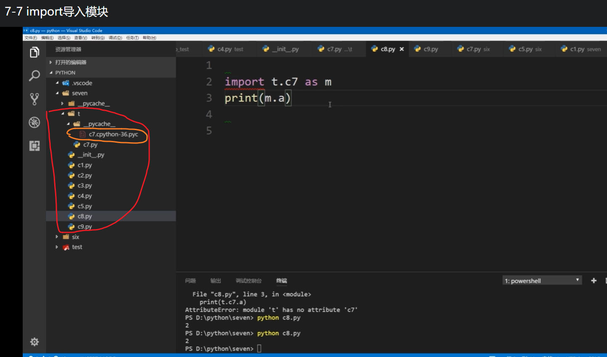
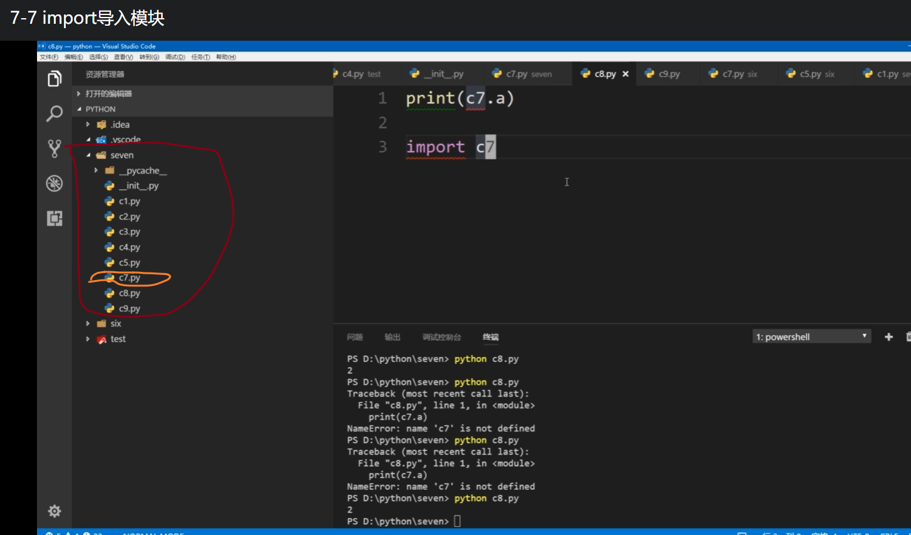
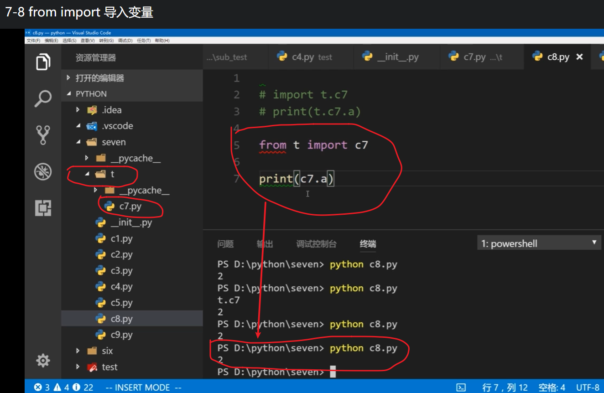

# 模块

## 模块的导入`import`

- `import()`
- 不同包下模块的导入:`import(空间命名.模块名)` ,`import(空间命名.模块名 as 新名字)`




## 导入变量

### `form 包名.模块名 import 变量`

    

### 批量导入`__init__.py`

注:

- 包和模块是不会被重复导入
- 避免循环导入

## 模块内置变量

`dir()`,用于查看某个模块或类的所有变量

```py
    a=2
    b=1
    c=3

    infos=dir()
    print(infos)

```

```py
打印结果:['__annotations__', '__builtins__', '__cached__', '__doc__', '__file__', '__loader__',
'__name__', '__package__', '__spec__', 'a', 'b', 'c']

```

## 入口文件和普通模块内置变量的区别

`__name__`

## 相对导入和绝对导入
