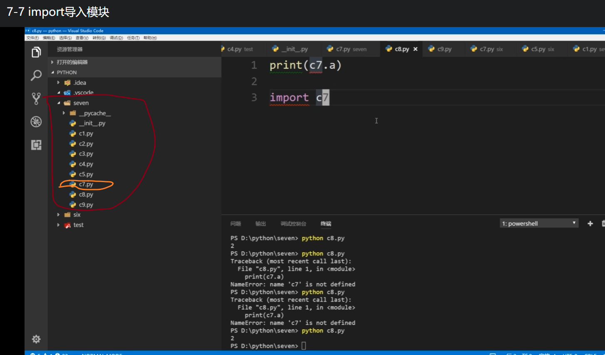

# 模块

## 模块的导入`import`

- `import()`
- 不同包下模块的导入:`import(空间命名.模块名)` ,`import(空间命名.模块名 as 新名字)`

## 导入变量

### `form 包名.模块名 import 变量`

    

### 批量导入`__init__.py`

注:

- 包和模块是不会被重复导入
- 避免循环导入

## 模块内置变量

## 入口文件和普通模块内置变量的区别

`__name__`
`dir()`

## 相对导入和绝对导入
